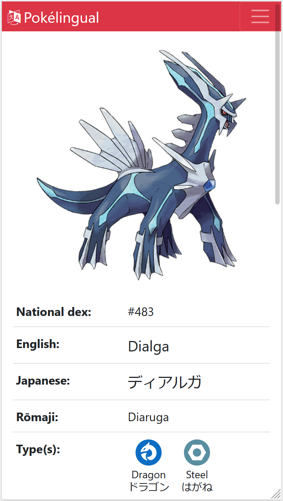

# Pokélingual

Pokélingual is a English/Japanese Pokedex to designed to help learn Japanese.  
ポケリンガルは英語の勉強を支援するために開発した日英ポケモン図鑑です。

### Features | 機能
- Advanced search with autocomplete suggestions via Elasticsearch | 検索時に Elasticsearch による自動補完
- Clean interface with mobile support | シンプルなデザインでスマホ対応
- View list of Pokemon by region | 地方ごとにポケモンを閲覧
- Switch between English and Japanese at any time | いつでも言語を切り替え

| Desktop \| パソコン | Mobile \| スマホ |
|:---:|:---:|
|  |  |

### Installation instructions | インストール方法 (Ubuntu 18.04, 20.04)

Install rbenv

    curl -fsSL https://github.com/rbenv/rbenv-installer/raw/master/bin/rbenv-installer | bash
    source ~/.bashrc

Install dependencies for Ruby install

    sudo apt install build-essential libssl-dev libreadline-dev zlib1g-dev

Install Ruby 2.7.1

    rbenv install 2.7.1
    rbenv global 2.7.1

Install Node.js

    sudo apt install nodejs

Install Yarn

    npm install -g yarn

Install SQLite client library

    sudo apt install libsqlite3-dev

Install Elasticsearch

    curl -fsSL https://artifacts.elastic.co/GPG-KEY-elasticsearch | sudo apt-key add -
    echo "deb https://artifacts.elastic.co/packages/7.x/apt stable main" | sudo tee -a /etc/apt/sources.list.d/elastic-7.x.list
    sudo apt update
    sudo apt install elasticsearch

Clone repository

    git clone git@github.com:summersky1/pokelingual.git

Install dependencies

    bundle install --without production
    yarn install

Setup database

    bundle exec rails db:migrate
    bundle exec rails db:seed

Setup Elasticsearch index

    cp .env.sample .env
    rails console
    Pokemon.import(force: true)
    exit

Run tests  
Note: Autocomplete test uses selenium driver and will fail without Google Chrome installed.  
注意：自動補完のテストは selenium 仕様によって Google Chrome がインストールされていないと失敗します。

    bundle exec rspec

Finally start app!

    bundle exec rails server
